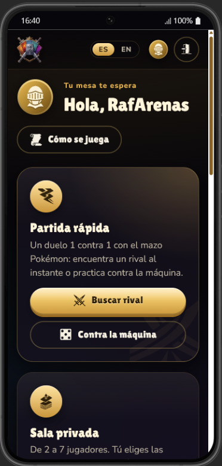
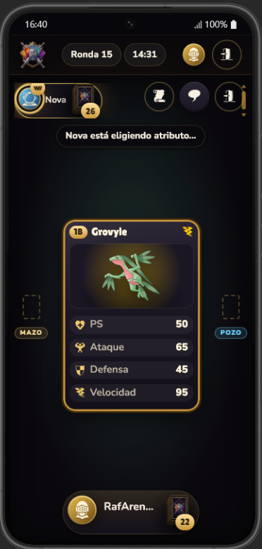
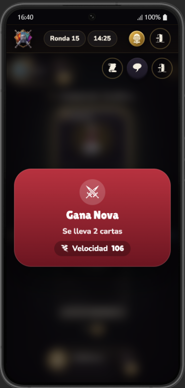
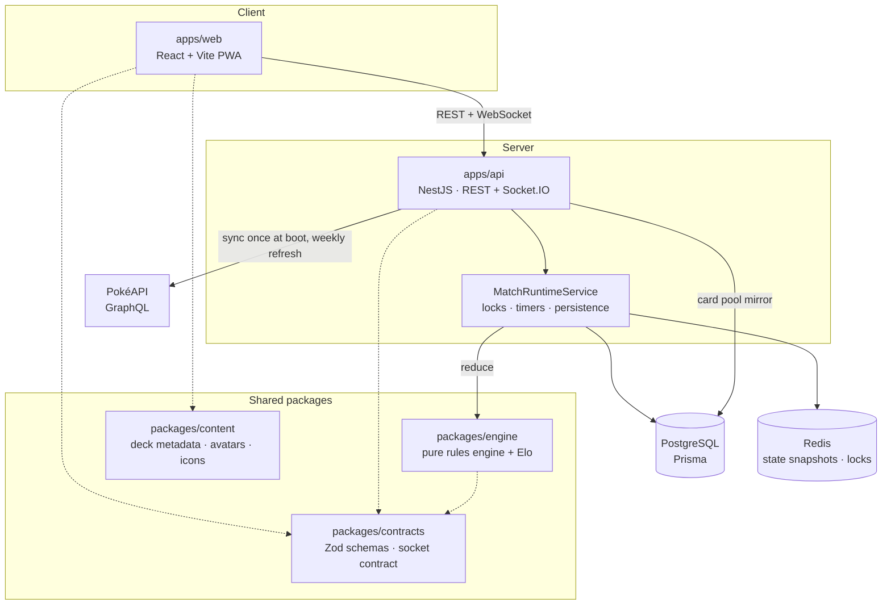
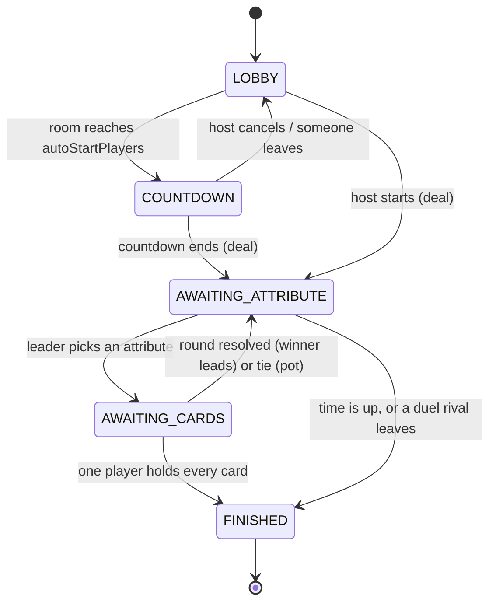

# Kardux Battle

A real-time, multiplayer card battle in the "Top Trumps" family, played with **Pokémon**: choose
which stat of your card to compete with, beat everyone at the table on it and take their cards. From 2 to 7
players per table, quick 1-vs-1 matches, a practice rival, a real ranking, Spanish and English,
and an installable PWA that plays on a phone as well as on a desktop.

> **Play it live:** <https://kardux-battle.onrender.com> ·
> **API docs (Swagger):** <https://kardux-battle.onrender.com/api/docs> ·
> **Status:** <https://kardux-battle.onrender.com/health>
>
> Free hosting: if nobody has opened it for a while, the first visit can take up to a minute
> while the server wakes up.

It started as the **SENASOFT 2022** programming challenge ("Siigo Match Battle") and grew into a
portfolio project: a TypeScript monorepo with an authoritative NestJS game server, a pure and
deterministic rules engine, and a React client built around the table choreography.

<p align="center">
  
  
  
  
</p>

## Contents

- [From the brief to the game](#from-the-brief-to-the-game)
- [How to play](#how-to-play)
- [Scoring and ranking](#scoring-and-ranking)
- [Architecture](#architecture)
- [Engineering highlights](#engineering-highlights)
- [Tech stack](#tech-stack)
- [Installable app (PWA)](#installable-app-pwa)
- [Run it locally](#run-it-locally)
- [Configuration](#configuration)
- [Testing](#testing)
- [Deployment](#deployment)
- [Fork, clone and contribute](#fork-clone-and-contribute)
- [Documentation map](#documentation-map)
- [Credits and license](#credits-and-license)

## From the brief to the game

The original brief asked for a web game with 4 packs of 8 cards, 2 to 7 players and quartets
coded `1A…4H`. Every rule is implemented, and each one lives in the pure engine
(`packages/engine`) with its own tests.

| SENASOFT 2022 rule                                                               | In Kardux Battle                                                                                                                                         |
| -------------------------------------------------------------------------------- | -------------------------------------------------------------------------------------------------------------------------------------------------------- |
| 4 packs of 8 cards, quartets `1A, 2A, 3A, 4A`…                                   | Default deck: 4 × 8 = 32 Pokémon. Every quartet (letter) is one Pokémon type; the host can change packs (1-6) and quartets (2-16).                       |
| Cards with a picture and technical specs                                         | Official artwork and base stats (HP, Attack, Defense, Speed, Sp. Attack, Sp. Defense) from PokéAPI; 3 to 6 of them per match.                            |
| 2 to 7 players                                                                   | Enforced by the shared Zod schema (`MAX_PLAYERS = 7`) on both client and server.                                                                         |
| The creator gets a hexadecimal match code                                        | 6-character hex room code, plus a share link (WhatsApp, Telegram, email, native share).                                                                  |
| The host may start once enough players join; the 7th player starts it on its own | Host "Start" once `minPlayers` is met; auto-start with a countdown when `autoStartPlayers` (7 by default) are seated. The host can cancel the countdown. |
| Deal every possible card, leftovers chosen at random                             | The deck is shuffled with a seeded RNG, then dealt round-robin; the remainder stays on the **deck spot** at the table, marked "out of play".             |
| Each player only sees the top card of their pile                                 | The server redacts the state per player (`redactFor`): nobody ever receives another player's cards.                                                      |
| `1A` starts; otherwise `1B`, `1C`… then `2A`; then join order                    | `findFirstTurnPlayerId` + `buildTurnOrder`, with tests for the fallback order.                                                                           |
| The player on turn picks a spec, everyone lays their top card, highest wins      | The leader taps an attribute; every card is laid down in turn order, flipped, compared; the winner collects them and leads the next round.               |
| Tie: the cards stay on the table and a new round starts                          | A **pot** spot on the table collects tied cards; the winner of the next round takes it too.                                                              |
| Ends when someone has every card, or after 1 hour (most cards wins, else a draw) | Both, with a configurable duration (10 min to 1 h, or no limit).                                                                                         |

**Beyond the brief**

- **Quick match**: a 1-vs-1 queue that pairs two people who are searching, or a practice match
  against the machine ("Nova").
- **Accounts and a real ranking**: registered players get a multiplayer Elo rating, wins, draws,
  losses, win rate, streak and favorite attribute. Guests can play right away without signing up.
- **Leaving is a forfeit, never a pause**: in a duel the rival wins with every card; with three or
  more players the leaver's cards are shared out and the match goes on.
- **Resilience**: a reload or a brief network drop keeps your seat for 45 s; match state is
  snapshotted to Redis after every move, so an API restart does not lose a game.
- **Table choreography**: shuffle and deal from the deck spot (piles count up as cards land),
  cards flying from each seat, 3D flips, a result banner centered on the table over a blur, cards
  collected into the winner's pile or the pot.
- **Chat** with unread badge, live standings, turn timer, rules dialog.
- **Spanish and English** everywhere, installable **PWA**, responsive from small phones to desktop.

## How to play

1. Create a private room (registered players) or press **Find a rival** / **Vs the machine**.
2. Share the room code or link; the match starts when the host presses **Start** or when the
   room fills up.
3. The cards are dealt. Whoever holds `1A` (or the next code in order) leads the first round.
4. On your turn, your top card appears: tap the attribute you want to compete with (any of them;
   the trick is picking one your rivals are likely to have lower). Everyone's top card is laid
   down, then flipped. Highest value wins every card on the table; a tie sends them to the pot.
5. The winner leads the next round. You are out when you run out of cards.
6. The match ends when one player holds every card or time runs out.

## Scoring and ranking

- **In a match** your score is the number of cards you hold; your final place is decided by it.
  Leaving the match puts you last, with zero cards.
- **In the ranking** every account starts at **1200 points**. After each match between registered
  accounts, points move with a multiplayer **Elo** rating: the table is scored as every pair of
  players facing each other once (1 for finishing above, ½ for the same place, 0 for below),
  weighted by the rating gap and scaled by `K / (N - 1)` with `K = 32`. Beating stronger players is
  worth more; losing to weaker ones costs more.
- Matches against the machine or with guests are never ranked, and a match is only rated once
  (`Match.ratedAt`), even if the job is retried.

The math is a pure, tested module: [`packages/engine/src/rating.ts`](packages/engine/src/rating.ts).

## Architecture



- **The server is authoritative.** The client never decides anything: it sends intents
  (`round:selectAttribute`, `match:leave`) and renders the redacted state the server pushes back.
- **The engine is a pure reducer**: `(state, action, { now }) -> { state, events }`, with no I/O,
  no `Date.now()` and no `Math.random()`. The API owns time, sockets and persistence around it.
- **Cards come from our own database.** PokéAPI is queried once at boot (a single GraphQL request
  for 1025 Pokémon, Spanish and English names) and mirrored into `card_pool_entries`; matches never
  wait on, or break because of, a third-party API.

### Match state machine



### Monorepo layout

```
kardux-battle/
├─ apps/
│  ├─ api/        NestJS: auth, rooms, Socket.IO gateway, match runtime, ranking, card pool
│  └─ web/        React + Vite PWA: home, lobby, table, ranking, i18n (es/en)
├─ packages/
│  ├─ contracts/  Zod schemas, socket event contract, error codes, table timing
│  ├─ engine/     pure rules engine (reduce, deal, turn order, redaction) and Elo rating
│  └─ content/    Pokémon deck metadata, avatars, game-icons.net glyphs
├─ scripts/dev.mjs   one command for the whole local stack
└─ docs/          ADRs, spec, build plan, session log, screenshots
```

## Engineering highlights

- **Deterministic, replayable matches.** A seeded sfc32 RNG lives inside the match state, so the
  same seed and actions always produce the same match (there is a byte-for-byte replay test).
- **Hidden information by construction.** `redactFor(viewer, state)` is the only way state leaves
  the server; played cards only appear in the `round:revealed` event.
- **One timing contract for server and client.** `TABLE_TIMING` (deal and reveal lengths) lives in
  `@kardux/contracts`. The engine opens each turn only after the table has finished animating
  (`turnOpensAt`), and the practice rival waits for it too, so a new round can never start while
  the previous one is still on screen.
- **Concurrency.** Every action for a match runs through an in-process mutex plus a best-effort
  Redis lock; the state is snapshotted to Redis after each accepted action.
- **Forfeits and reconnection.** A dropped socket keeps its seat for 45 s; after an API restart the
  gateway releases the seats of whoever did not come back.
- **Measured, declarative animations.** Cards fly from the real position of each seat's pile to
  the table and back to the winner, measured from the DOM on every screen size. The table layout
  computes the biggest card size that fits the players in play (a duel on a phone stacks the two
  cards vertically).
- **Typed i18n.** Every string lives in `apps/web/src/i18n/locales/{es,en}.json`; keys are
  type-checked against the Spanish catalog and `pnpm --filter @kardux/web i18n:check` fails if the
  two catalogs drift apart.
- **Zero-trust payloads.** Every REST body and socket payload is validated with the same Zod
  schemas on both ends; OpenAPI docs are generated from them (`/api/docs`).

## Tech stack

| Layer        | Choice                                                                   | Why                                                         |
| ------------ | ------------------------------------------------------------------------ | ----------------------------------------------------------- |
| Monorepo     | pnpm workspaces + Turborepo                                              | [ADR 0001](docs/adr/0001-monorepo-pnpm-turborepo.md)        |
| API          | NestJS 11, Socket.IO, Pino logging, rate limiting, Helmet                | [ADR 0002](docs/adr/0002-nestjs-over-alternatives.md)       |
| Rules engine | Pure TypeScript, seeded RNG, no I/O                                      | [ADR 0003](docs/adr/0003-pure-rules-engine.md)              |
| Data         | PostgreSQL + Prisma, Redis (ioredis)                                     | [ADR 0004](docs/adr/0004-postgres-redis-swappable-cache.md) |
| API docs     | Swagger generated from Zod (`nestjs-zod`), bilingual                     | [ADR 0005](docs/adr/0005-api-docs-and-http-client.md)       |
| Card data    | PokéAPI GraphQL mirrored into `card_pool_entries`                        | [ADR 0006](docs/adr/0006-local-card-pool-mirror.md)         |
| Web          | React 18, Vite, Framer Motion, React Router, i18next, vite-plugin-pwa    | [`docs/SPEC.md`](docs/SPEC.md)                              |
| Auth         | JWT per browser tab, bcrypt passwords, optional 30-day "stay signed in"  | [`docs/SPEC.md`](docs/SPEC.md)                              |
| Quality      | Vitest, Supertest, socket.io-client, ESLint, Prettier, Husky, commitlint | [`docs/SPEC.md`](docs/SPEC.md)                              |

## Installable app (PWA)

Kardux Battle is a Progressive Web App built with `vite-plugin-pwa` (Workbox):

- **Install**: after signing in, Chrome, Edge and Android show an "Install Kardux Battle" card
  (the browser's `beforeinstallprompt` is captured at startup and offered at a calm moment, never
  mid-match); on iPhone the card explains _Share → Add to Home Screen_.
- **Launch screen**: a branded splash while the app loads; Android builds its native splash from
  the manifest (name, colors, 512 px icon).
- **Offline shell**: the app shell and assets are precached; the API and the live game always use
  the network. New versions update silently in the background.
- **Store-style install dialog**: the manifest ships screenshots, categories and an `id`.

## Run it locally

Requirements: Node.js 24+, pnpm 10+, PostgreSQL 14+ and Redis 7+ (all free and open source).

```bash
git clone https://github.com/RafArenasDev/Kardux-Battle.git
cd Kardux-Battle
pnpm install
cp apps/api/.env.example apps/api/.env   # database URL, Redis URL, JWT secret
psql -U postgres -h localhost -c "CREATE DATABASE kardux_dev;"
pnpm dev
```

`pnpm dev` (`scripts/dev.mjs`) starts Redis if it is not running, applies the Prisma migrations,
builds the shared packages and runs the API (**http://localhost:3000**, Swagger at `/api/docs`)
and the web app (**http://localhost:5173**) together. `Ctrl+C` stops everything it started.

There is no seed data: create your account from the sign-up screen. To try a match alone, open
two browser windows (each tab is its own player) or play **Vs the machine**.

## Configuration

All server settings are environment variables, validated at boot by a Zod schema
([`apps/api/src/config/app-config.ts`](apps/api/src/config/app-config.ts)); the template is
[`apps/api/.env.example`](apps/api/.env.example).

| Variable                                           | Purpose                                                         |
| -------------------------------------------------- | --------------------------------------------------------------- |
| `DATABASE_URL`, `DB_*`                             | PostgreSQL connection                                           |
| `REDIS_URL`                                        | Redis/Valkey for live match snapshots and locks (optional)      |
| `JWT_SECRET`, `JWT_GUEST_TTL`                      | Session signing and guest session length                        |
| `CORS_ORIGINS`                                     | Extra allowed origins (the service's own URL is always allowed) |
| `RATE_LIMIT_TTL_MS`, `RATE_LIMIT_MAX`              | Global rate limit per IP                                        |
| `RETENTION_FINISHED_DAYS`, `RETENTION_EVENTS_DAYS` | How long finished matches and the event log are kept            |
| `RETENTION_MAX_DB_MB`                              | Database size at which all match history is cleared             |
| `DISABLED_DECKS`                                   | Kill switch to hide a deck without a code change                |
| `VITE_API_BASE_URL` (web, optional)                | API URL when the web app is hosted on a different origin        |

Game rules are configured per room from the create screen: players (2-7), minimum to start,
auto-start threshold, packs and quartets, attributes per card (3-6), cards per player, match
duration and time per turn.

## Testing

```bash
pnpm lint        # ESLint across the monorepo (zero warnings)
pnpm typecheck
pnpm test        # contracts, engine (coverage thresholds) and API (unit + socket integration)
pnpm build       # production build, including the PWA
pnpm --filter @kardux/web i18n:check
```

- `packages/engine`: the rules of the brief, chained ties, eliminations, every leave scenario
  (duel forfeit, shared-out cards, countdown cancel), turn timeouts, the deal remainder, the Elo
  math, and a full reproducible match from a fixed seed.
- `apps/api`: services with mocked Prisma, plus a real game loop over Socket.IO against the local
  database.
- `apps/api/scripts/smoke-table.mjs`: a scripted 3-player private match against a running API
  (auto-start, rounds, two players leaving, ranking update), using existing accounts from
  `SMOKE_ACCOUNTS`.

## Deployment

Production runs on free tiers - details, commands and the maintenance jobs in
[`docs/DEPLOY.md`](docs/DEPLOY.md):

- **Render** (free web service): one Node process serves the REST API, the Socket.IO game
  server, Swagger and the built PWA from the same origin. Every push to `main` builds and deploys
  automatically (`render.yaml`); migrations run on start; `/health` is the health check.
- **Aiven** (free PostgreSQL 1 GB + free Valkey): the database and the cache.
- **Always reachable**: an uptime monitor pings `/health` every few minutes so the free instance
  never sleeps; every ping also touches the database.
- **Self-healing**: Render restarts the process if it crashes or `/health` fails; Prisma and the
  Redis client reconnect on their own; seats of players who never came back are released
  automatically, even across restarts.
- **Stays under 1 GB**: an hourly retention job prunes old matches, the event log and idle guest
  accounts, with a size guard that clears all match history near the limit.

## Fork, clone and contribute

1. Fork the repository on GitHub (or clone it directly) and follow [Run it locally](#run-it-locally).
2. Create a branch, make your change, and keep the checks green: `pnpm lint`, `pnpm typecheck`,
   `pnpm test`, `pnpm build`.
3. Commits follow [Conventional Commits](https://www.conventionalcommits.org) (`feat:`, `fix:`,
   `docs:`…), enforced by commitlint; Husky runs ESLint and Prettier on staged files.
4. New UI text goes into both `apps/web/src/i18n/locales/es.json` and `en.json`
   (`pnpm --filter @kardux/web i18n:check` verifies they match).
5. Game rules live in `packages/engine` as pure functions: add a test there first, then wire the
   API and the client.
6. Open a pull request describing the change and how you tested it.

Ideas that fit the architecture: more decks from other public APIs (`DECK_SOURCE_IDS` plus a
card-pool sync), spectator mode polish, match replays from the `match_events` log, and a
Playwright end-to-end run of a 7-player table.

## Documentation map

- [`docs/SPEC.md`](docs/SPEC.md): the full game and technical spec.
- [`docs/adr/`](docs/adr/): why each non-obvious technical decision was made.
- [`docs/tasks/`](docs/tasks/): the phase-by-phase build plan.
- [`docs/PENDING-WORK.md`](docs/PENDING-WORK.md): session-by-session log and what comes next.
- [`API-TESTING.md`](API-TESTING.md): exercising the REST API by hand.
- [`docs/DEPLOY.md`](docs/DEPLOY.md): production on Render + Aiven free tiers, keep-alive and data retention.

## Credits and license

MIT, see [`LICENSE`](./LICENSE). A free, non-commercial fan project with no payments or
purchases.

- Pokémon data and artwork via [PokéAPI](https://pokeapi.co). Pokémon © Nintendo, Game Freak and
  The Pokémon Company; this project is not affiliated with them.
- Interface icons by Lorc, Delapouite and contributors at
  [game-icons.net](https://game-icons.net), licensed under CC BY 3.0.
