# Kardux Battle

**A real-time, multiplayer Pokémon card battle, built as a production-grade TypeScript system.**

Two to seven players sit at a virtual table. Each round, the player on turn chooses which stat of
their top card to compete with; every card is laid face down, flipped together, and the highest
value takes the whole table. Rooms by code, quick 1-vs-1 matches, a practice rival, a real Elo
ranking, Spanish and English, and an installable PWA that plays as well on a phone as on a desktop.

## Live links

| What                                      | Link                                          |
| ----------------------------------------- | --------------------------------------------- |
| **Play the game**                         | <https://kardux-battle.onrender.com>          |
| **API documentation (Swagger)**           | <https://kardux-battle.onrender.com/api/docs> |
| **Service status** (API, database, cache) | <https://kardux-battle.onrender.com/health>   |

The Swagger UI is interactive: open it, run _Sign in_ or _Play as guest_ under **Accounts and
sign-in**, press **Authorize** with the returned token, and every endpoint can be tried from the
browser. It has a Spanish/English selector.

> Hosted on free tiers. If nobody has opened it for a while, the first visit can take up to a
> minute while the server wakes up.

---

## Contents

1. [Project overview](#1-project-overview)
2. [Screenshots on every device](#2-screenshots-on-every-device)
3. [Origin: from a first project to a production system](#3-origin-from-a-first-project-to-a-production-system)
4. [Game mechanics](#4-game-mechanics)
5. [Use cases](#5-use-cases)
6. [System architecture](#6-system-architecture)
7. [How a round works (sequence)](#7-how-a-round-works-sequence)
8. [Match state machine](#8-match-state-machine)
9. [Data model](#9-data-model)
10. [API reference](#10-api-reference)
11. [Client architecture](#11-client-architecture)
12. [Scoring and ranking](#12-scoring-and-ranking)
13. [Security](#13-security)
14. [Reliability and operations](#14-reliability-and-operations)
15. [Installable app (PWA)](#15-installable-app-pwa)
16. [Internationalization](#16-internationalization)
17. [Tech stack and official documentation](#17-tech-stack-and-official-documentation)
18. [Repository structure](#18-repository-structure)
19. [Run it locally](#19-run-it-locally)
20. [Configuration](#20-configuration)
21. [Testing and quality](#21-testing-and-quality)
22. [Deployment](#22-deployment)
23. [Design decisions (ADRs)](#23-design-decisions-adrs)
24. [Fork, clone and contribute](#24-fork-clone-and-contribute)
25. [Roadmap](#25-roadmap)
26. [Credits and license](#26-credits-and-license)

---

## 1. Project overview

| Aspect    | Summary                                                                                         |
| --------- | ----------------------------------------------------------------------------------------------- |
| What      | A multiplayer "Top Trumps"-style card battle with 1,025 real Pokémon and their base stats       |
| Who plays | Guests (no sign-up) and registered accounts; 2 to 6 players per table                           |
| How       | Private rooms by hex code or link, quick 1-vs-1 matchmaking, or a practice match vs the machine |
| Real time | WebSockets (Socket.IO): every card, flip and result is pushed to every seat as it happens       |
| Fair play | The server is authoritative and each player only ever receives their own top card               |
| Where     | Any modern browser; installable as an app (PWA) on Android, iOS, Windows and macOS              |
| Languages | Spanish and English, switchable at any time                                                     |
| Hosting   | Render (app) + Aiven (PostgreSQL, Valkey) on free tiers, self-maintaining                       |

The codebase is a **pnpm + Turborepo monorepo**: a NestJS server, a React client and three shared
packages (contracts, rules engine, content) that both sides import, so the client and the server
can never disagree on a type, a rule or a timing.

## 2. Screenshots on every device

The interface is designed mobile-first and measured, not just scaled: the table always fits one
screen with no scrolling, and card sizes are computed from the space actually available.

### Phone

<p align="center">
  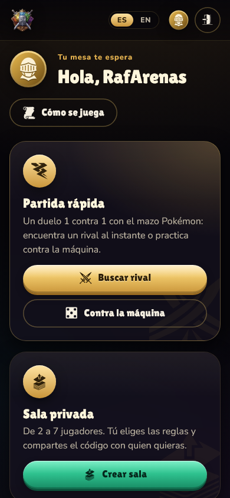
  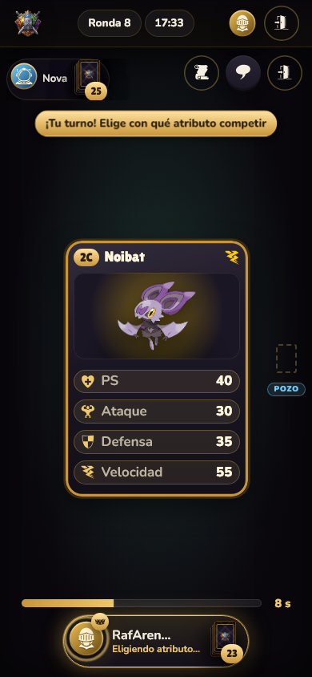
  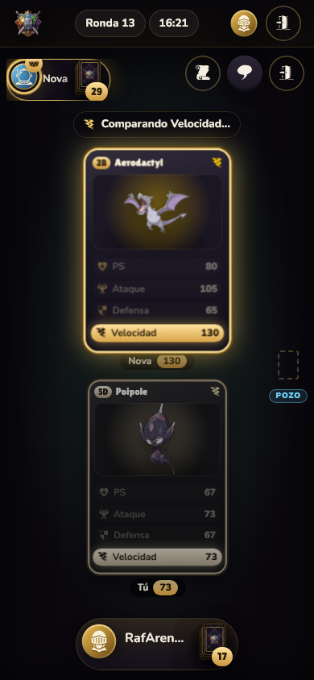
  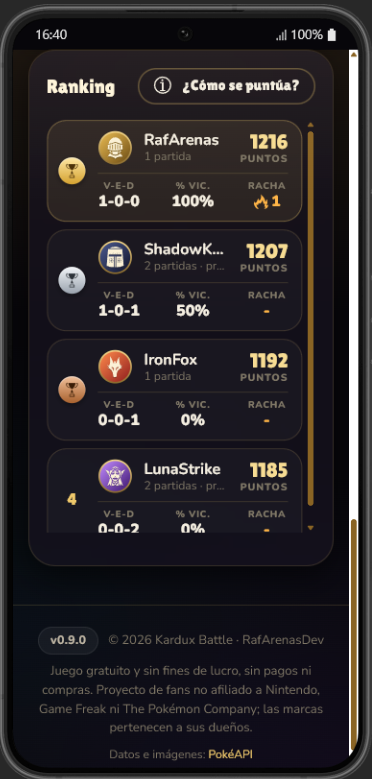
</p>

### Tablet

<p align="center">
  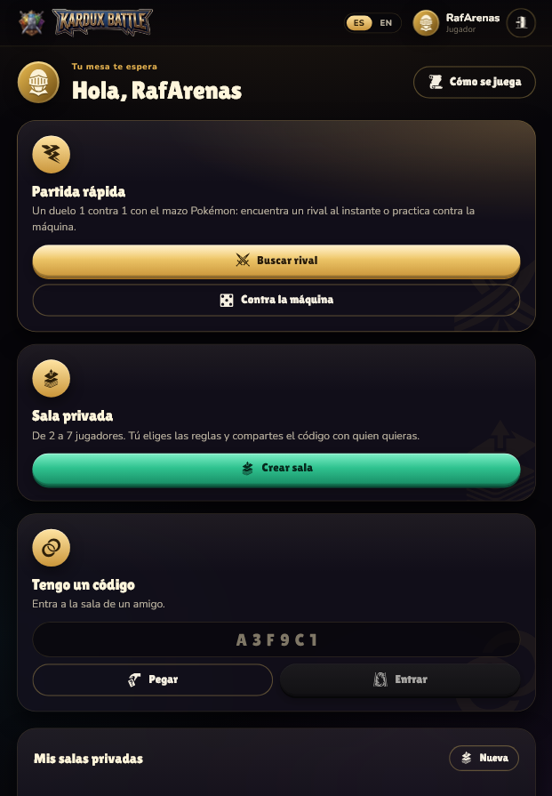
  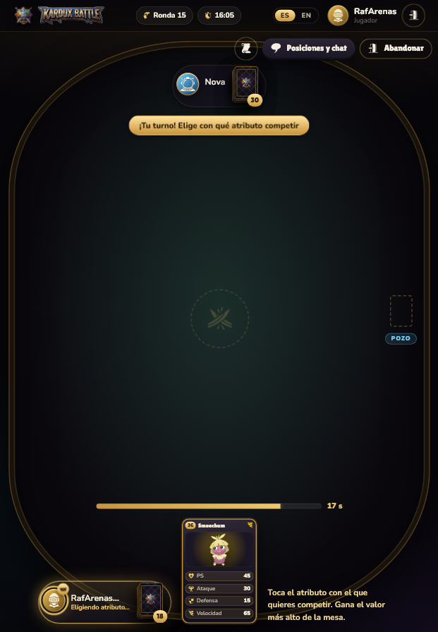
</p>

### Laptop

<p align="center">
  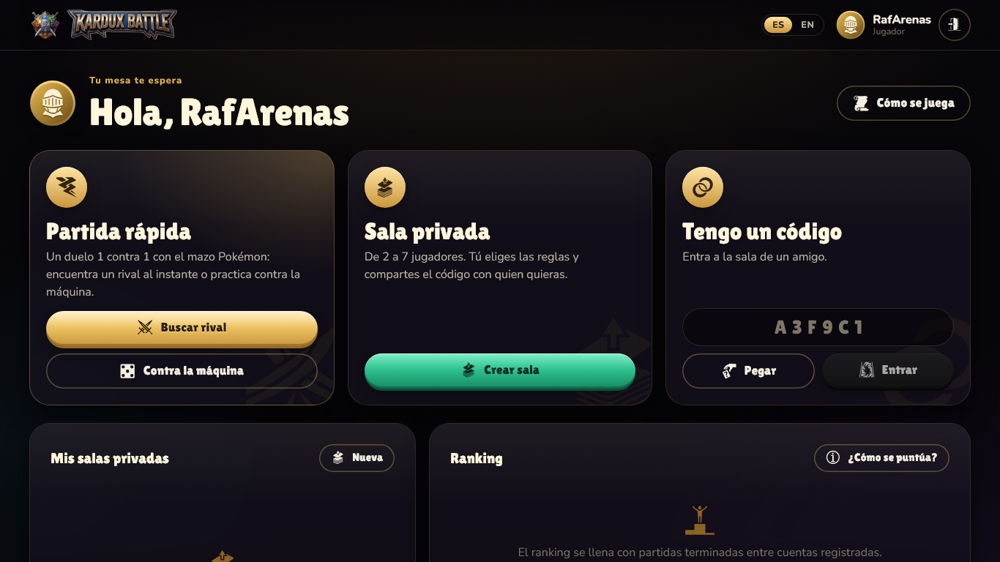
</p>
<p align="center">
  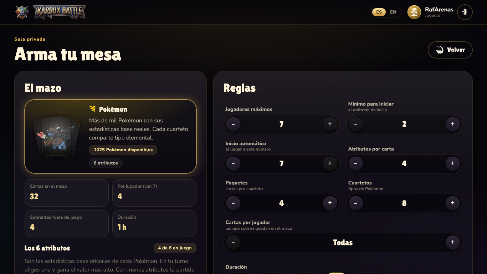
</p>

### Desktop

<p align="center">
  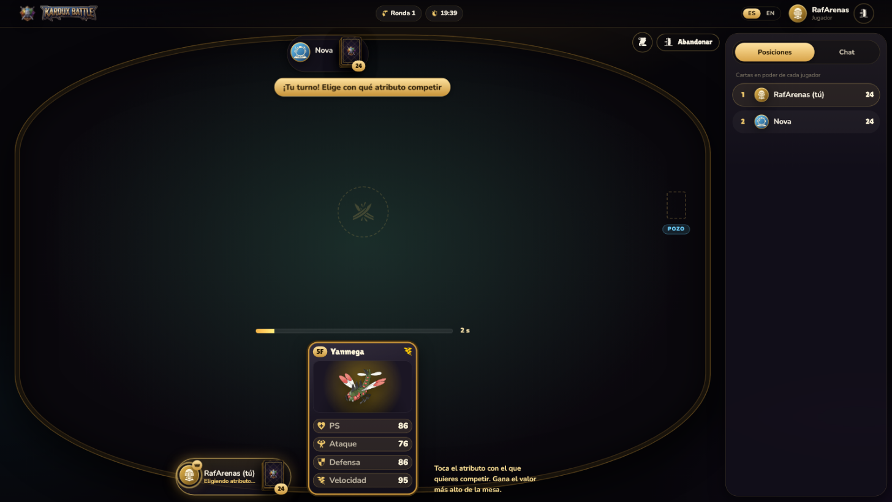
</p>
<p align="center">
  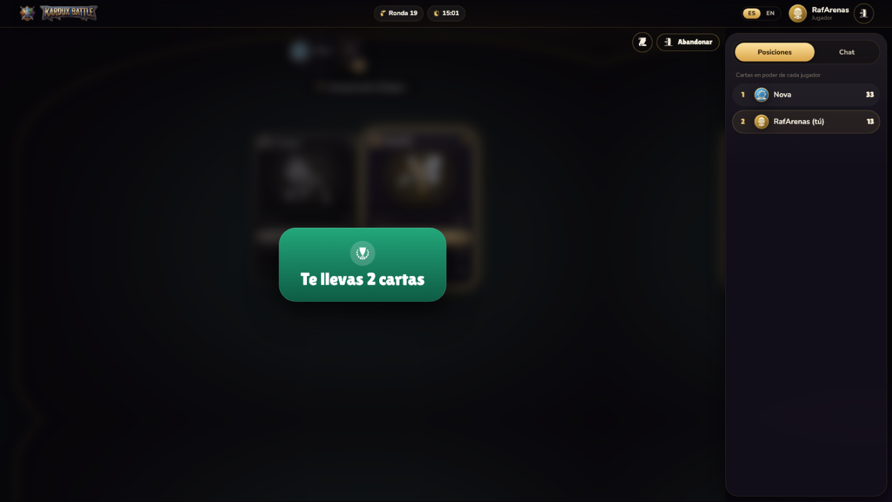
</p>

### Full table, live in production

A room at the max of 7 concurrent players, played to completion in production to check for lag,
desync or crashes as the seat count grows. Every tab stayed in lockstep: round results, card
counts and turn ownership matched across all seven at once, and the leader-picks-the-attribute
rule held correctly as the win passed from player to player round after round.

<p align="center">
  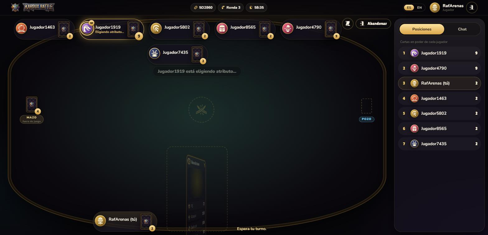
</p>

## 3. Origin: from a first project to a production system

Kardux Battle began years ago as one of my first projects, back when I was just starting out as a
developer: a card game of quartets for 2 to 7 players, with cards coded `1A…4H` and a simple rule
set. It stayed in a drawer for a long time. With more experience behind me, I decided to bring it
back to life and build it the way I would build a real product today: an authoritative real-time
server, a deterministic rules engine with tests, accounts and a ranking, animations, an installable
app and an actual deployment.

Every one of the original rules is still there, implemented in the pure rules engine
(`packages/engine`) and covered by tests:

| Original rule                                                                   | Implementation today                                                                                                                                                                                            |
| ------------------------------------------------------------------------------- | --------------------------------------------------------------------------------------------------------------------------------------------------------------------------------------------------------------- |
| 4 packs of 8 cards, quartets `1A, 2A, 3A, 4A`…                                  | Default deck: 4 × 8 = 32 Pokémon. Each quartet letter is one Pokémon type; packs (1-6) and quartets (2-16) are configurable.                                                                                    |
| Cards with a picture and technical specs                                        | Official artwork and base stats (HP, Attack, Defense, Speed, Sp. Attack, Sp. Defense) from PokéAPI; 3 to 6 per match.                                                                                           |
| 2 to 7 players                                                                  | Enforced by one shared Zod schema (`MAX_PLAYERS = 6`) on client and server - capped one below the brief's 7 so the table can reserve a fixed, evenly-split seat layout (3 top, 3 bottom) instead of an odd one. |
| The creator receives a hexadecimal match code                                   | 6-character hex room code plus a share link (WhatsApp, Telegram, e-mail, native share).                                                                                                                         |
| The admin starts once enough join; the 7th player starts it automatically       | "Start" once `minPlayers` is met; an auto-start countdown when `autoStartPlayers` (6 by default) are seated, cancelable by the host.                                                                            |
| Deal every possible card; leftovers chosen at random                            | Seeded shuffle, round-robin deal; the remainder stays on the **deck spot**, marked "out of play". Optional fixed number of cards per player.                                                                    |
| Each player only sees the top card of their pile                                | Per-player state redaction on the server (`redactFor`).                                                                                                                                                         |
| `1A` starts; otherwise `1B`, `1C`… then `2A`; then joining order                | `findFirstTurnPlayerId` + `buildTurnOrder`, tested for the fallback order.                                                                                                                                      |
| The player on turn picks a spec; everyone lays their top card; highest wins     | Cards land face down in turn order, flip together, the winning card lights up, the winner takes the table and leads the next round.                                                                             |
| Tie: the cards stay on the table and a new round starts                         | A **pot** spot collects tied cards; the next round's winner takes them too.                                                                                                                                     |
| End when someone holds every card, or after 1 hour (most cards wins, else draw) | Both, with a configurable duration (10 min to 1 h, or unlimited).                                                                                                                                               |

**What the first version never had:** real-time multiplayer over WebSockets, quick matchmaking, a
practice rival, accounts and a multiplayer Elo ranking, forfeit rules, reconnection, chat, a
bilingual UI, an installable PWA, a documented REST API, automated tests and a self-maintaining
cloud deployment.

## 4. Game mechanics

1. **The deck.** Quartets of Pokémon of the same type (`1A`-`4A` are all Fire, for example). Every
   card carries the same attributes, so any card can be compared with any other.
2. **The deal.** The deck is shuffled with a seeded RNG and dealt one card at a time around the
   table. Cards that do not divide evenly (or exceed the chosen cards per player) stay on the deck
   spot, out of play; after an exact deal the deck spot disappears. Everyone sees only the top card
   of their own pile.
3. **Who starts.** Whoever holds `1A` (else `1B`, `1C`… `2A`…) leads the first round. In a practice
   match the person always starts.
4. **A round.** The leader chooses **any** attribute to compete with, not necessarily their highest:
   the trick is picking one the rivals are likely to have lower. Every top card is laid face down in
   turn order, then all flip. The highest value wins every card on the table.
5. **Ties.** Tied cards go to the pot; the winner of the next round takes the pot as well.
6. **Out of cards.** A player with no cards left is knocked out and keeps watching.
7. **Leaving.** Leaving is final and counts as a loss. In a duel, the rival wins with every card; with
   three or more players, the leaver's cards are dealt out to the others and the match goes on.
8. **The end.** When one player holds every card, or when time runs out: most cards wins, equal
   counts are a draw.

The table shows every step as a separate beat: the attribute is announced, cards land face down,
they flip, the winning card glows, a banner says who takes how many cards, and the cards fly to the
winner. The server waits for that choreography before it opens the next turn.

## 5. Use cases

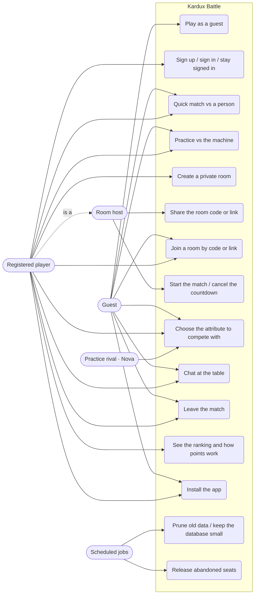

| #    | Use case                | Actor             | Main flow                                                                               | Rules                                                                |
| ---- | ----------------------- | ----------------- | --------------------------------------------------------------------------------------- | -------------------------------------------------------------------- |
| UC1  | Play as a guest         | Guest             | "Play as guest" → random name and avatar → home                                         | Guests never host rooms; their session lives in one tab              |
| UC2  | Sign up / sign in       | Player            | Username + password (+ avatar) → session; optional 30-day "stay signed in"              | Live username availability with suggestions; bcrypt hashes           |
| UC3  | Quick match             | Guest, Player     | "Find a rival" → searching card → rival found → countdown → deal                        | 1 vs 1, 32 cards, 20 min; two simultaneous searches are paired       |
| UC4  | Practice vs the machine | Guest, Player     | "Vs the machine" → Nova sits down → the person leads the first round                    | 48 cards; never ranked                                               |
| UC5  | Create a private room   | Player            | Players, auto-start, packs, quartets, attributes, cards per player, duration, turn time | Validated against the deck's real limits before creating             |
| UC6  | Share the room          | Host              | Tap the code to copy it, or share the link (WhatsApp, Telegram, e-mail, native share)   | The link opens the join screen, even before signing in               |
| UC7  | Join by code or link    | Guest, Player     | Paste the code or open `/join/CODE` → preview → join; late joiners watch as spectators  | Room full → clear error                                              |
| UC8  | Start / cancel          | Host              | "Start" once the minimum is seated; auto-start countdown when the room fills            | Only the host; a leaver can stop the countdown                       |
| UC9  | Choose the attribute    | Leader            | Tap an attribute when the turn opens → every card is laid down and resolved             | A timeout picks one at random                                        |
| UC10 | Chat                    | Seated players    | Standings and chat panel; unread badge                                                  | Rate-limited, rendered as text only                                  |
| UC11 | Leave the match         | Any seated player | "Leave" → confirmation → back home                                                      | Duel: rival wins with all cards. 3+: cards shared out, match goes on |
| UC12 | Ranking                 | Player            | Podium, points, W-D-L, win rate, streak, favorite attribute; "How is it scored?"        | Refreshes on its own                                                 |
| UC13 | Install the app         | Guest, Player     | Install card after signing in (or _Share → Add to Home Screen_ on iPhone)               | Never shown mid-match; remembered if dismissed                       |
| UC14 | Data retention          | Scheduled job     | Hourly: prune old matches, event log and idle guests; size guard near 1 GB              | Accounts, ranking and card pool are never pruned                     |
| UC15 | Release abandoned seats | Server            | 45 s after a disconnect (or after a restart) the seat is released as a leave            | A reload within the grace period keeps the seat                      |

## 6. System architecture

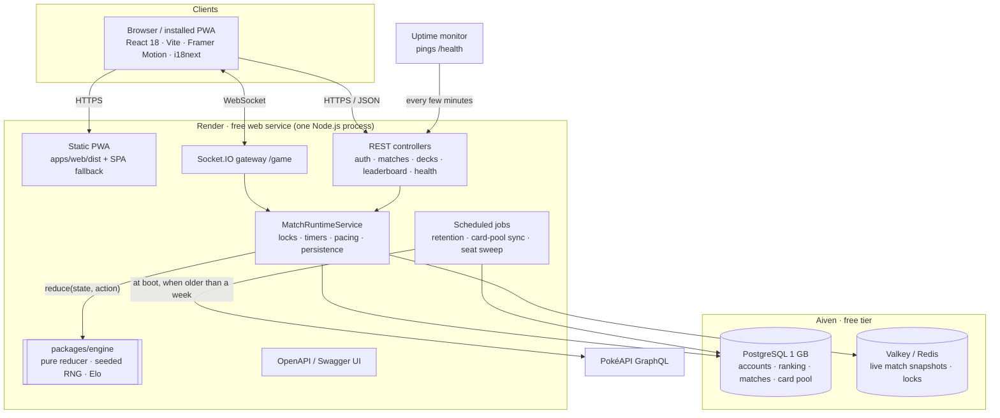

**Principles**

- **Authoritative server.** Clients send intents (`round:selectAttribute`, `match:leave`) and render
  what the server pushes. No client decides a result or sees another player's card.
- **Pure core, impure shell.** `packages/engine` is a deterministic reducer:
  `reduce(state, action, { now }) → { state, events }`, with no I/O, no `Date.now()` and no
  `Math.random()`. The API owns time, sockets, persistence and pacing around it.
- **One source of truth for contracts.** Zod schemas in `packages/contracts` validate every REST
  body and socket payload on both ends and generate the OpenAPI document.
- **Own copy of third-party data.** PokéAPI is synced into `card_pool_entries` at boot (at most once a week);
  matches never depend on an external API being up.
- **Single origin in production.** One process serves the PWA, REST, WebSockets and Swagger: no
  CORS round trips and a single instance to keep awake.

### Real time and concurrency

A card table is a concurrency problem: several players act at once, timers fire while messages are
in flight, and connections drop mid-round. This is how the server handles it.

| Mechanism                        | What it does                                                                                                                                                                                           |
| -------------------------------- | ------------------------------------------------------------------------------------------------------------------------------------------------------------------------------------------------------ |
| **WebSockets (Socket.IO)**       | One persistent, bidirectional connection per browser tab on the `/game` namespace. Each match is a Socket.IO **room**, so an event is broadcast to exactly the players seated at that table.           |
| **Heartbeat**                    | Ping/pong every 20 s detects dead connections (a phone that lost signal) without waiting for TCP timeouts.                                                                                             |
| **Event loop, non-blocking I/O** | Node.js runs the game on a single thread with an event loop: database, cache and network calls are asynchronous, so a slow query never freezes other tables.                                           |
| **Per-match async mutex**        | Every action on a match (choose an attribute, play a card, leave, a timer firing) runs inside `withLock(matchId)`: actions on the same table are serialized, different tables run in parallel.         |
| **Distributed lock (Redis)**     | On top of the mutex, a `SET key NX PX` lock in Redis with a TTL, so a second server instance could never apply two actions to the same match at once.                                                  |
| **Timers**                       | Turn timeouts, auto-start countdowns, the practice rival's pacing and the 45 s reconnect grace are timers owned by the server; each one re-enters through the lock, never around it.                   |
| **Choreography gate**            | `turnOpensAt`: the server computes how long the table animation lasts (shared `revealSchedule`) and does not accept the next turn before it ends, so fast clients cannot outrun the show.              |
| **Snapshots**                    | After every accepted action the match state is written to Redis, so a restart resumes live matches instead of losing them.                                                                             |
| **Asynchronous persistence**     | Rounds, the event log and ratings are written to PostgreSQL after the state is pushed to the players, keeping the game loop fast.                                                                      |
| **Background jobs**              | An hourly `@nestjs/schedule` cron for data retention with a database-size guard; at boot, the PokéAPI card-pool sync (when older than a week) and a sweep that frees seats abandoned across a restart. |
| **Idempotency**                  | Ratings are applied once per match (`Match.ratedAt`); retries or duplicated events never count a result twice.                                                                                         |

Worker threads are not needed: the work per action is tiny (compare a few numbers) and all the waiting
is I/O, which is exactly what the event loop is built for. The heavy lifting is keeping order, and
that is what the locks and the pure reducer guarantee.

## 7. How a round works (sequence)

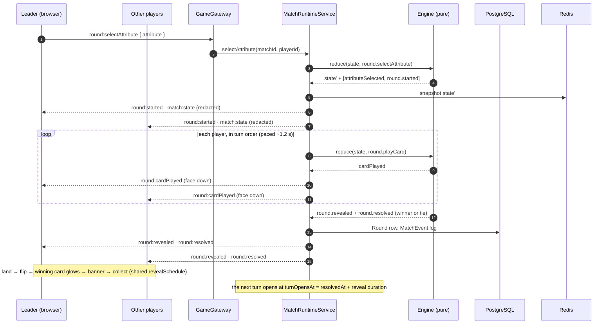

## 8. Match state machine

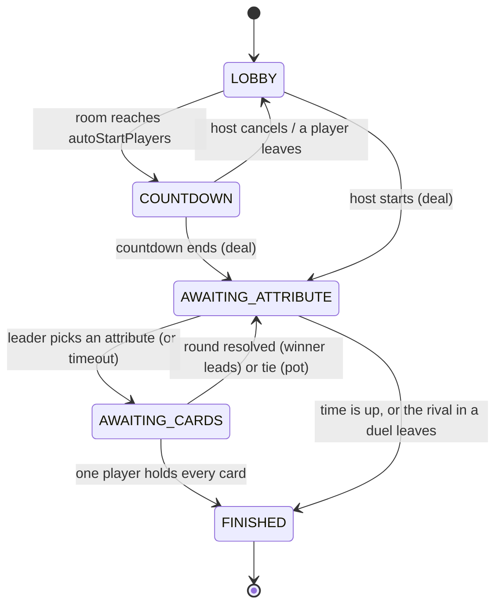

Dealing, revealing and resolving are real steps reported as events (so the client can animate
them) but not states the server waits in: there is no decision to make during them.

## 9. Data model

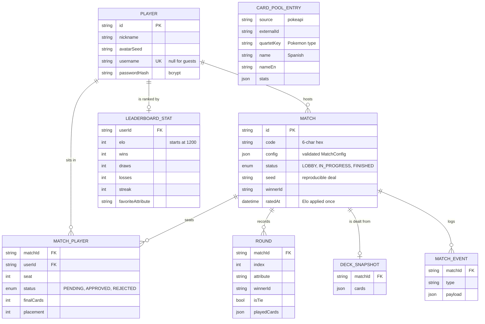

Live match state (piles, turn, timers, RNG) lives in memory and is snapshotted to Redis after every
accepted action; PostgreSQL keeps the durable record. Migrations are versioned with Prisma and
always incremental.

## 10. API reference

Interactive documentation, generated from the same Zod schemas that validate requests:
**<https://kardux-battle.onrender.com/api/docs>** (Spanish/English selector; locally at
`http://localhost:3000/api/docs`).

### REST

| Method   | Path                   | Auth   | Purpose                                            |
| -------- | ---------------------- | ------ | -------------------------------------------------- |
| `POST`   | `/auth/guest`          | -      | Guest session (random name and avatar)             |
| `POST`   | `/auth/register`       | -      | Create an account; optional "stay signed in" token |
| `GET`    | `/auth/check-username` | -      | Live availability with suggestions                 |
| `POST`   | `/auth/login`          | -      | Sign in                                            |
| `POST`   | `/auth/resume`         | -      | Trade a remember token for a new tab session       |
| `POST`   | `/matches`             | Bearer | Create a private room (registered accounts only)   |
| `GET`    | `/matches/mine`        | Bearer | The host's rooms                                   |
| `GET`    | `/matches/active`      | Bearer | The room the caller is seated in                   |
| `GET`    | `/matches/:code`       | Bearer | Room preview by code                               |
| `DELETE` | `/matches/:matchId`    | Bearer | Host deletes the room; a player leaves it          |
| `GET`    | `/decks/sources`       | Bearer | Deck catalog with preview cards and limits         |
| `GET`    | `/leaderboard`         | Bearer | Ranking (keyset pagination)                        |
| `GET`    | `/health`              | -      | Process, database and cache status                 |

Errors always come back as `{ code, message }` with stable codes (`ERR_MATCH_FULL`,
`ERR_NOT_YOUR_TURN`, …) that the client translates.

### Socket.IO (namespace `/game`)

| Direction       | Events                                                                                                                                                                                                                                                                                                        |
| --------------- | ------------------------------------------------------------------------------------------------------------------------------------------------------------------------------------------------------------------------------------------------------------------------------------------------------------- |
| Client → server | `match:join`, `match:quick`, `match:rejoin`, `match:start`, `match:cancelCountdown`, `match:config`, `match:leave`, `round:selectAttribute`, `round:playCard`, `chat:send`, `ping:latency`                                                                                                                    |
| Server → client | `match:state` (redacted per player), `match:playerJoined`, `match:playerLeft`, `match:countdown`, `match:started`, `round:started`, `round:attributeSelected`, `round:cardPlayed`, `round:revealed`, `round:resolved`, `round:tie`, `match:finished`, `match:closed`, `chat:message`, `pong:latency`, `error` |

The handshake carries a JWT bound to the browser tab (`userId:tabId`), so two tabs are two
independent players and a reload lands back in the same seat.

## 11. Client architecture

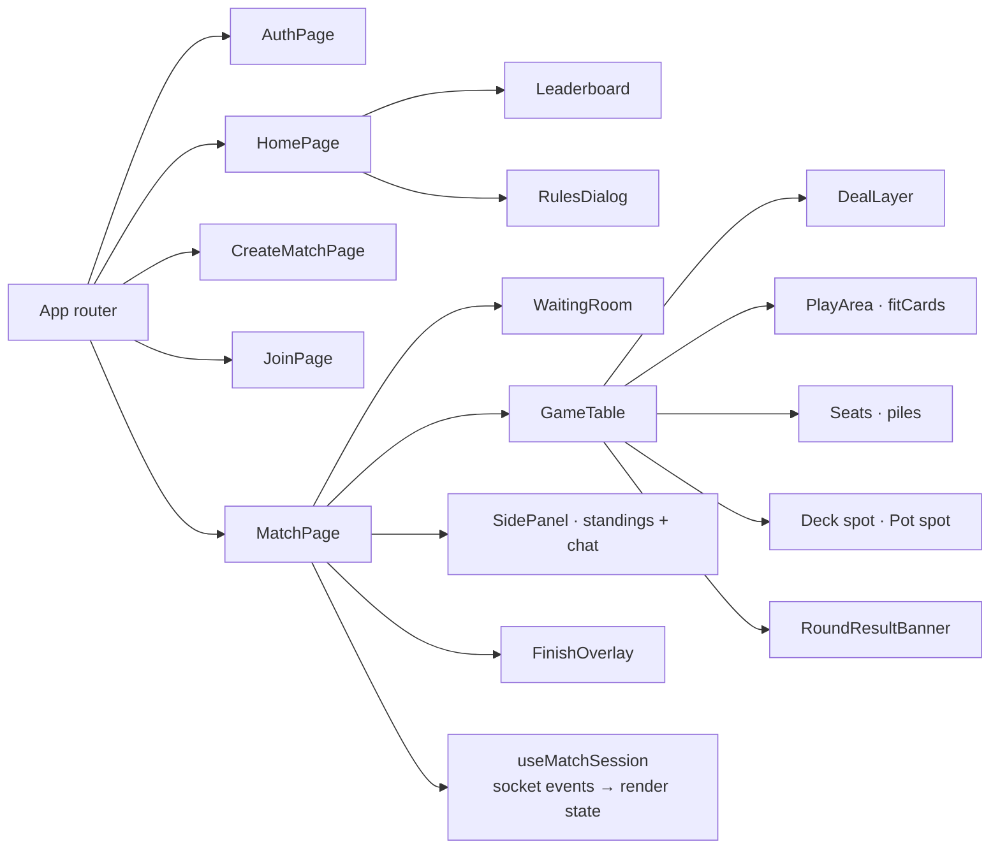

- **`useMatchSession`** turns the socket event stream into render state: it schedules the reveal
  (land → flip → compare → result → collect) with the shared `revealSchedule`, freezes pile counts
  until collected cards actually land, and times the deal.
- **Declarative motion.** Cards fly from the real on-screen position of each pile to the table and
  back to the winner, measured from the DOM; no imperative animation controls, so nothing gets lost
  after many rounds.
- **`fitCards`** computes the biggest card size that fits the players in play on the current screen
  (a duel on a phone stacks the two cards vertically).
- **Responsive by construction.** The table is exactly one screen tall; on phones the leader chooses
  in the middle of the table and the player's area becomes a slim bar.

## 12. Scoring and ranking

- **In a match**, your score is the number of cards you hold; your final place comes from it.
  Leaving places you last with zero cards.
- **In the ranking**, every account starts at **1,200 points**. After each match between registered
  accounts, points move with a multiplayer **Elo** rating: the table is scored as every pair of
  players facing each other once (1 for finishing above, ½ for the same place, 0 for below),
  weighted by the rating gap and scaled by `K / (N − 1)` with `K = 32`.
- Matches against the machine or with guests are not ranked, and a match is rated exactly once
  (`Match.ratedAt`), even if the job is retried.
- The ranking shows points, wins-draws-losses, win rate, current streak and favorite attribute,
  with gold, silver and bronze trophies for the podium.

The rating is a pure, unit-tested module: [`packages/engine/src/rating.ts`](packages/engine/src/rating.ts).

## 13. Security

| Area               | Measure                                                                                               |
| ------------------ | ----------------------------------------------------------------------------------------------------- |
| Hidden information | Per-player redaction; played cards are only sent at reveal time                                       |
| Authentication     | JWT per browser tab; bcrypt password hashes; remember tokens are separate and revoked on sign-out     |
| Input validation   | Zod on every REST body and socket payload, both ends                                                  |
| Abuse              | Global rate limit per IP, stricter limits on sign-in; chat rate limit and control-character stripping |
| HTTP hardening     | Helmet with a strict Content-Security-Policy (only PokéAPI artwork is allowed as an external image)   |
| Secrets            | Only in environment variables; `.env` is git-ignored; no headers or tokens in production logs         |
| Privacy            | No e-mail or personal data collected; guests are disposable identities                                |

## 14. Reliability and operations

| Concern                | How it is handled                                                                                               |
| ---------------------- | --------------------------------------------------------------------------------------------------------------- |
| Concurrent actions     | In-process mutex per match plus a best-effort Redis lock                                                        |
| Server restarts        | Live match state snapshotted to Redis after every action; seats not reclaimed within 45 s are released          |
| Dropped connections    | 45 s grace to reconnect (reloads, mobile app switching); after that the seat counts as a leave                  |
| Timing races           | `turnOpensAt`: the next turn opens only after the table finished animating; the practice rival waits for it too |
| Third-party outages    | PokéAPI data is mirrored in PostgreSQL; the game never calls it during play                                     |
| Crashes and hangs      | Render restarts the process when it exits or `/health` fails                                                    |
| Database / cache blips | Prisma and the Redis client reconnect on their own; without Redis the game keeps working in memory              |
| Free-tier sleep        | An uptime monitor pings `/health` every few minutes (each ping also touches the database)                       |
| Storage cap (1 GB)     | Hourly retention job plus a size guard; see [`docs/DEPLOY.md`](docs/DEPLOY.md)                                  |

## 15. Installable app (PWA)

- **Install prompt.** Chromium's `beforeinstallprompt` is captured at startup and offered after
  signing in (never mid-match); on iPhone the app explains _Share → Add to Home Screen_.
- **Launch screen.** A branded splash while the app loads; Android builds its native splash from the
  manifest.
- **Offline shell.** Workbox precaches the app shell and assets; the API and live game always use the
  network. New versions update silently in the background.
- **Store-style install dialog.** The manifest includes an `id`, categories and screenshots.

## 16. Internationalization

Every string lives in [`apps/web/src/i18n/locales`](apps/web/src/i18n/locales) (`es.json`,
`en.json`) and is used through **i18next** with type-checked keys. Plurals use i18next's `_one` /
`_other` forms; messages that depend on who is involved are separate keys ("You take 3 cards" vs
"ShadowKnight takes 3 cards"). `pnpm --filter @kardux/web i18n:check` fails if the two catalogs
drift apart. Game content (Pokémon names, stat labels) and API error messages ship in both
languages.

## 17. Tech stack and official documentation

| Layer             | Technology                                                 | Documentation                                                                                        |
| ----------------- | ---------------------------------------------------------- | ---------------------------------------------------------------------------------------------------- |
| Language          | TypeScript (strict)                                        | <https://www.typescriptlang.org/docs/>                                                               |
| Monorepo          | pnpm workspaces, Turborepo                                 | <https://pnpm.io/workspaces> · <https://turbo.build/repo/docs>                                       |
| API               | NestJS 11 (Express), Socket.IO                             | <https://docs.nestjs.com> · <https://socket.io/docs/v4/>                                             |
| Validation / docs | Zod, nestjs-zod, Swagger (OpenAPI)                         | <https://zod.dev> · <https://docs.nestjs.com/openapi/introduction>                                   |
| Data              | PostgreSQL, Prisma ORM                                     | <https://www.postgresql.org/docs/> · <https://www.prisma.io/docs>                                    |
| Cache / locks     | Valkey (Redis-compatible), ioredis                         | <https://valkey.io/docs/> · <https://github.com/redis/ioredis>                                       |
| Auth / security   | JWT (`@nestjs/jwt`), bcryptjs, Helmet, `@nestjs/throttler` | <https://docs.nestjs.com/security/authentication> · <https://helmetjs.github.io>                     |
| Logging / jobs    | Pino (`nestjs-pino`), `@nestjs/schedule`                   | <https://getpino.io> · <https://docs.nestjs.com/techniques/task-scheduling>                          |
| Web               | React 18, Vite, React Router, Framer Motion                | <https://react.dev> · <https://vitejs.dev/guide/> · <https://reactrouter.com> · <https://motion.dev> |
| i18n              | i18next, react-i18next                                     | <https://www.i18next.com> · <https://react.i18next.com>                                              |
| PWA               | vite-plugin-pwa, Workbox                                   | <https://vite-pwa-org.netlify.app> · <https://developer.chrome.com/docs/workbox>                     |
| Card data         | PokéAPI (GraphQL)                                          | <https://pokeapi.co/docs/graphql>                                                                    |
| Testing           | Vitest, Supertest, socket.io-client                        | <https://vitest.dev> · <https://github.com/ladjs/supertest>                                          |
| Quality           | ESLint, Prettier, Husky, lint-staged, commitlint           | <https://eslint.org> · <https://prettier.io> · <https://commitlint.js.org>                           |
| Hosting           | Render (web service), Aiven (PostgreSQL, Valkey)           | <https://render.com/docs> · <https://aiven.io/docs>                                                  |

## 18. Repository structure

```
kardux-battle/
├─ apps/
│  ├─ api/                  NestJS server
│  │  ├─ prisma/            schema and versioned migrations
│  │  ├─ scripts/           smoke tests against a running API
│  │  └─ src/
│  │     ├─ auth/           guest, register, login, remember tokens, JWT guard
│  │     ├─ match/          rooms and quick-match lobbies
│  │     ├─ game/           Socket.IO gateway, MatchRuntimeService, seat grace
│  │     ├─ deck/           PokéAPI card-pool mirror and deck builder
│  │     ├─ leaderboard/    ranking queries and the Elo RatingService
│  │     ├─ maintenance/    retention job and size guard
│  │     ├─ health/         /health (database + cache)
│  │     ├─ docs/           bilingual OpenAPI setup
│  │     └─ common/         errors, Socket.IO adapter, static web app
│  └─ web/                  React PWA
│     ├─ public/            icons, manifest assets, screenshots
│     ├─ scripts/           i18n catalog check
│     └─ src/
│        ├─ features/       auth, home, create, join, match, rules
│        ├─ components/     cards, layout, UI primitives
│        ├─ i18n/           i18next setup and es/en catalogs
│        ├─ lib/            API client, socket, session, install, errors
│        └─ styles/         design tokens and component styles
├─ packages/
│  ├─ contracts/            Zod schemas, socket contract, errors, table timing
│  ├─ engine/               pure rules engine, deal, turn order, redaction, Elo
│  └─ content/              Pokémon deck metadata, avatars, icons
├─ docs/                    ADRs, game spec, deploy guide, media
├─ scripts/dev.mjs          one command for the whole local stack
├─ render.yaml              Render Blueprint
└─ .github/workflows/       keep-alive ping
```

## 19. Run it locally

**Requirements:** Node.js 24+, pnpm 10+, PostgreSQL 14+, Redis 7+ (or Valkey). All free and open
source.

```bash
git clone https://github.com/RafArenasDev/Kardux-Battle.git
cd Kardux-Battle
pnpm install
cp apps/api/.env.example apps/api/.env      # database URL, Redis URL, JWT secret
psql -U postgres -h localhost -c "CREATE DATABASE kardux_dev;"
pnpm dev
```

`pnpm dev` (`scripts/dev.mjs`) starts Redis if it is not running, applies migrations, builds the
shared packages and runs the API (**http://localhost:3000**, Swagger at `/api/docs`) and the web
app (**http://localhost:5173**) together. `Ctrl+C` stops everything it started.

There is no seed data: create an account from the sign-up screen. To try a match alone, open two
browser windows (each tab is its own player) or play **Vs the machine**.

**Production build locally:** `pnpm build`, then `node apps/api/dist/main.js` serves the API and
the built PWA together on port 3000.

## 20. Configuration

All server settings are environment variables validated at boot by a Zod schema
([`apps/api/src/config/app-config.ts`](apps/api/src/config/app-config.ts)); the template is
[`apps/api/.env.example`](apps/api/.env.example).

| Variable                                           | Purpose                                                         |
| -------------------------------------------------- | --------------------------------------------------------------- |
| `DATABASE_URL`, `DB_*`                             | PostgreSQL connection                                           |
| `REDIS_URL`                                        | Redis/Valkey for live match snapshots and locks (optional)      |
| `JWT_SECRET`, `JWT_GUEST_TTL`                      | Session signing and guest session length                        |
| `CORS_ORIGINS`                                     | Extra allowed origins (the service's own URL is always allowed) |
| `RATE_LIMIT_TTL_MS`, `RATE_LIMIT_MAX`              | Global rate limit per IP                                        |
| `RETENTION_FINISHED_DAYS`, `RETENTION_EVENTS_DAYS` | How long finished matches and the event log are kept            |
| `RETENTION_MAX_DB_MB`                              | Database size at which all match history is cleared             |
| `DISABLED_DECKS`                                   | Kill switch to hide a deck without a code change                |
| `VITE_API_BASE_URL` (web, optional)                | API URL when the web app is hosted on another origin            |

Room rules are configured from the create screen: players (2-6), minimum to start, auto-start
threshold, packs, quartets, attributes per card (3-6), cards per player, match duration and time
per turn, all validated against the deck's real limits.

## 21. Testing and quality

```bash
pnpm lint          # ESLint across the monorepo, zero warnings allowed
pnpm typecheck     # strict TypeScript everywhere
pnpm test          # contracts, engine (coverage thresholds) and API (unit + socket integration)
pnpm build         # production build, including the PWA
pnpm --filter @kardux/web i18n:check
```

| Suite                              | What it covers                                                                                                                    |
| ---------------------------------- | --------------------------------------------------------------------------------------------------------------------------------- |
| `packages/contracts` (40 tests)    | Config rules (2-6 players, deck limits), payload schemas                                                                          |
| `packages/engine` (80 tests)       | Every original game rule, chained ties, knock-outs, all leave scenarios, turn timeouts, deal remainder, Elo, byte-for-byte replay |
| `apps/api` (36 tests)              | Services with mocked Prisma, health, leaderboard, and a real game loop over Socket.IO against a database                          |
| `apps/api/scripts/smoke-table.mjs` | Scripted 3-player private match against a running API: auto-start, rounds, two leavers, ranking update                            |

Engine coverage thresholds are enforced (90 % lines, functions and statements, 85 % branches).
Commits follow Conventional Commits (commitlint); Husky runs ESLint and Prettier on staged files.

## 22. Deployment

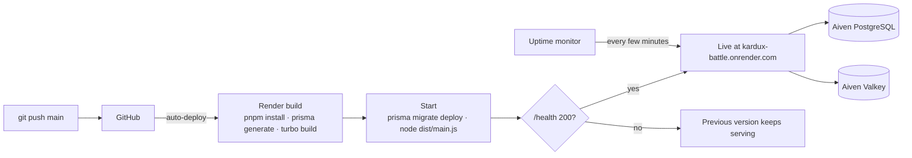

| Component          | Where                                                           |
| ------------------ | --------------------------------------------------------------- |
| Game (PWA) and API | <https://kardux-battle.onrender.com> (Render, free web service) |
| Swagger / OpenAPI  | <https://kardux-battle.onrender.com/api/docs>                   |
| Health             | <https://kardux-battle.onrender.com/health>                     |
| Database           | Aiven PostgreSQL (free, 1 GB)                                   |
| Cache              | Aiven Valkey (free)                                             |

- **Render** builds the whole monorepo on every push to `main`, runs migrations on start and only
  switches traffic once `/health` answers. Settings live in [`render.yaml`](render.yaml).
- **Always reachable:** an uptime monitor calls `/health` every few minutes so the free instance
  never sleeps.
- **Self-maintaining:** hourly retention with a size guard keeps the database well under 1 GB.

Full guide, commands and limits: [`docs/DEPLOY.md`](docs/DEPLOY.md).

## 23. Design decisions (ADRs)

| ADR                                                     | Decision                                                               |
| ------------------------------------------------------- | ---------------------------------------------------------------------- |
| [0001](docs/adr/0001-monorepo-pnpm-turborepo.md)        | pnpm + Turborepo monorepo so client and server share code              |
| [0002](docs/adr/0002-nestjs-over-alternatives.md)       | NestJS for a structured, testable API with first-class WebSockets      |
| [0003](docs/adr/0003-pure-rules-engine.md)              | A pure, deterministic rules engine separated from all I/O              |
| [0004](docs/adr/0004-postgres-redis-swappable-cache.md) | PostgreSQL for durable data, Redis as an optional, swappable cache     |
| [0005](docs/adr/0005-api-docs-and-http-client.md)       | OpenAPI generated from the validation schemas, never hand-written      |
| [0006](docs/adr/0006-local-card-pool-mirror.md)         | Mirror third-party card data locally instead of calling it during play |

## 24. Fork, clone and contribute

1. Fork the repository on GitHub (or clone it) and follow [Run it locally](#19-run-it-locally).
2. Create a branch and keep the checks green: `pnpm lint`, `pnpm typecheck`, `pnpm test`,
   `pnpm build`.
3. Commit with [Conventional Commits](https://www.conventionalcommits.org) (`feat:`, `fix:`,
   `docs:`…); Husky and commitlint enforce the format.
4. New UI text goes into both locale catalogs (`i18n:check` verifies them).
5. Game rules belong in `packages/engine` as pure functions: write the test there first, then wire
   the API and the client.
6. Database changes are new Prisma migrations, never edits to applied ones.
7. Open a pull request describing the change and how it was tested.

**Deploy your own copy:** create a PostgreSQL database and (optionally) a Redis/Valkey instance,
create a Render web service from your fork using [`render.yaml`](render.yaml), set the secret
environment variables, and point an uptime monitor at `/health`.

## 25. Roadmap

- More decks from other public APIs (new `DECK_SOURCE_IDS` plus a card-pool sync).
- Match replays from the `match_events` log.
- Playwright end-to-end run of a full 7-player table.
- Password recovery once a delivery channel is chosen.

## 26. Credits and license

MIT, see [`LICENSE`](./LICENSE). A free, non-commercial fan project with no payments or
purchases. Built by **Rafael Arenas** ([RafArenasDev](https://github.com/RafArenasDev)).

- Pokémon data and artwork via [PokéAPI](https://pokeapi.co). Pokémon © Nintendo, Game Freak and
  The Pokémon Company; this project is not affiliated with them.
- Interface icons by Lorc, Delapouite and contributors at [game-icons.net](https://game-icons.net),
  licensed under CC BY 3.0.
