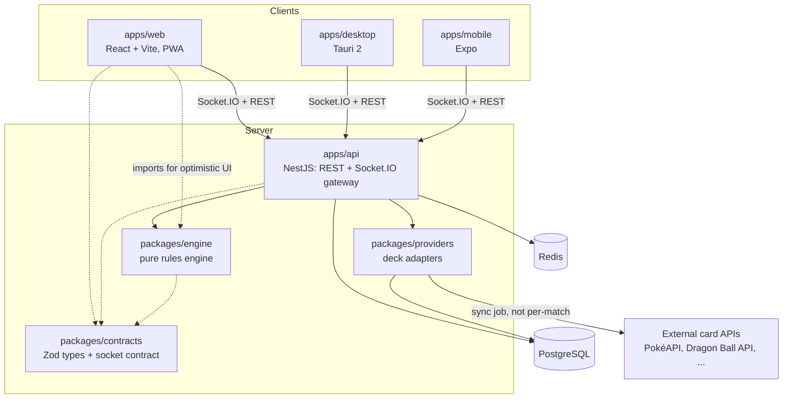
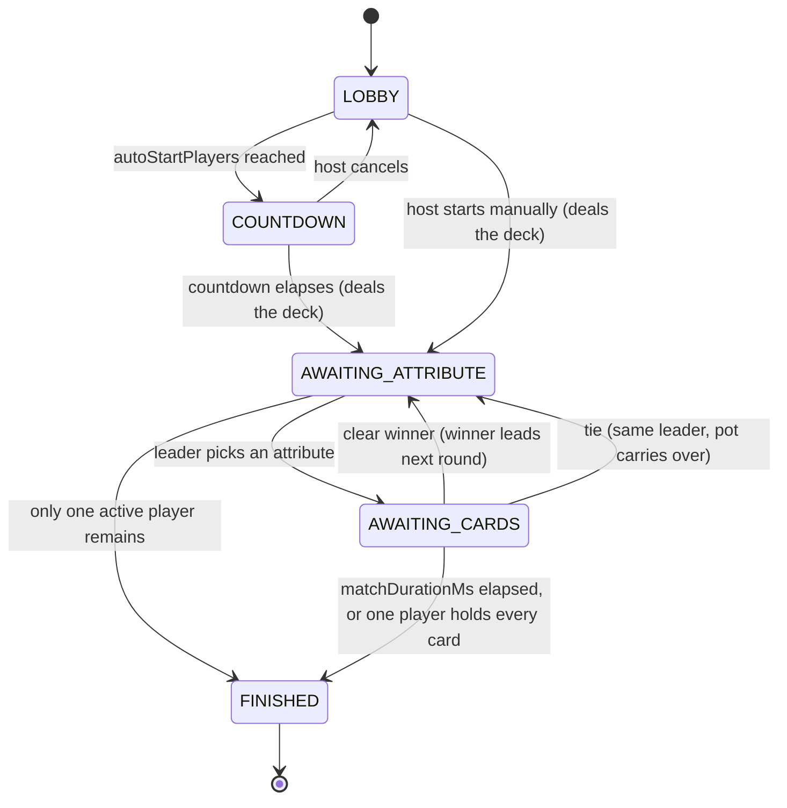

# Kardux Battle

A real-time, multiplayer Top Trumps–style card battle game — pick the strongest attribute of
your card, win the table. Play with **Pokémon** (official base stats via PokéAPI) or the classic
**poker deck** (Deck of Cards API), plus two original decks, in the browser today (installable
PWA) and later on desktop and mobile.

> This file is the single entry point for the project — setup, architecture, diagrams, and
> current status all live here, updated as each phase lands, instead of being deferred to a
> "final docs" phase. `docs/adr/` holds the reasoning behind each decision and `docs/tasks/`
> the phase-by-phase build plan, for anyone who wants to go deeper than this file — but
> everything you need to understand and run the project day to day is on this page.

## Status

**Playable end to end (v0.9, 2026-09-23).**

- **Decks**: Pokémon (1025 Pokémon, Spanish names, official base stats, one quartet per
  elemental type) and the 52-card poker deck are fetched **once** when the API boots (one
  PokéAPI GraphQL request, one Deck of Cards draw), stored in Postgres (`CardPoolEntry`) and
  re-synced at most weekly — gameplay never waits on a third-party API. Two original,
  copyright-free decks (Criaturas Míticas, Fauna Salvaje) ship bundled.
- **Rooms**: private rooms (registered players) are only listed in the host's panel and are
  shared by 6-char hex code or link (WhatsApp, Telegram, email, native share). Quick matches
  (anyone, guests included) pair two players instantly and auto-start — no approvals.
- **Real-time game**: shuffle + deal animation, your top card face-up and everyone else's
  face-down, the leader taps an attribute (their card is laid down automatically), the others
  drag their card up to throw it (or tap), 3D flip reveal, winner glow, tie pot, turn timers,
  live standings, chat, victory screen.
- **Persistence**: live match state is snapshotted to Redis after every move — reloading the
  page, a dropped connection or an API restart drops you back into the exact same seat.
- **Web**: responsive (phone / tablet / desktop hooks), installable PWA with offline shell,
  dark obsidian + gold design, rounded game UI, self-hosted fonts.

See [`docs/PENDING-WORK.md`](docs/PENDING-WORK.md) for the session-by-session log.

## The game

A quartet-comparison game in the "Top Trumps" family, played with `N` packs × `M` cards
(4×8 = 32 by default). Every card is coded `<number><letter>` (`1A`, `2A`, … `4H`); the cards
sharing a letter form a "quartet" from the same thematic family, and every card in the deck
shares the exact same set of numeric attributes (3 to 6 of them).

1. A host creates a match and gets a 6-character hex code; others join with it.
2. The host starts manually once `minPlayers` is met, or the match auto-starts (5s countdown,
   host-cancelable) once `autoStartPlayers` connect — both configurable per match, not fixed.
3. The deck is dealt evenly; any remainder is discarded at random before dealing. Each player
   sees only the top card of their own face-down pile.
4. Whoever holds `1A` goes first (searching `1A, 1B … 1M, 2A, 2B, …` if `1A` wasn't dealt to
   anyone); turn order after that follows join order.
5. The player in turn picks one attribute; everyone plays their top card face-down, then all
   flip at once. Highest value wins every card on the table.
6. A tie leaves the cards on the table as an accumulating pot; the same player leads the
   tie-breaking round, and whoever eventually wins claims the whole pot.
7. A player with no cards left is eliminated (becomes a spectator).
8. The match ends when one player holds every card, or when `matchDurationMs` elapses (most
   cards wins; a tied card count is a draw). Both are configurable, not fixed at 7 players or
   1 hour like the original brief.

Full canonical rules, including every configuration field and the socket event contract, live
in [`docs/SPEC.md`](docs/SPEC.md).

## Architecture



Non-negotiable principle: the server is authoritative. No client ever decides a round's
outcome or sees another player's cards — every socket receives a state redacted down to what
that specific player is allowed to see (`@kardux/engine`'s `redactFor`).

### Monorepo layout

```
kardux-battle/
├─ apps/
│  ├─ api/          NestJS: REST + Socket.IO gateway              (bootstrap only)
│  ├─ web/          React + Vite, PWA                              (not started)
│  ├─ desktop/      Tauri 2, wraps the web build                   (not started)
│  └─ mobile/       Expo / React Native                            (not started)
├─ packages/
│  ├─ contracts/    types + Zod schemas + socket event contract    (done)
│  ├─ engine/       pure, deterministic rules engine                (done)
│  ├─ providers/    deck adapters for each card API                 (not started)
│  └─ ui/           shared design tokens/components                 (not started)
├─ docker/          compose: postgres, redis, api, web              (not started)
├─ docs/
│  ├─ adr/          architecture decision records
│  ├─ tasks/        the phase-by-phase build plan this project follows
│  └─ PENDING-WORK.md   running session log
└─ docs/SPEC.md        canonical game rules and full technical spec
```

### Match state machine



`DEALING`, `REVEAL`, `RESOLVE`, and `TIE_POT` from the spec's state machine are real steps
the engine walks through and reports via its event stream (so the client can animate each one:
the deal, the flip, the comparison, the pot banner) but aren't states the server sits in
between player actions — there's no decision to make during them, so they resolve within the
same `reduce()` call as the action that triggered them. The diagram above shows the states
that actually persist and wait for the next action.

## Tech stack

| Layer                   | Choice                                                                                                                            | Why (ADR)                                                   |
| ----------------------- | --------------------------------------------------------------------------------------------------------------------------------- | ----------------------------------------------------------- |
| Monorepo                | pnpm workspaces + Turborepo                                                                                                       | [ADR 0001](docs/adr/0001-monorepo-pnpm-turborepo.md)        |
| API                     | NestJS 11 + Socket.IO                                                                                                             | [ADR 0002](docs/adr/0002-nestjs-over-alternatives.md)       |
| Rules engine            | Pure TypeScript, zero I/O, seeded RNG                                                                                             | [ADR 0003](docs/adr/0003-pure-rules-engine.md)              |
| Database                | PostgreSQL + Prisma                                                                                                               | [ADR 0004](docs/adr/0004-postgres-redis-swappable-cache.md) |
| Cache / locks / pub-sub | Redis                                                                                                                             | [ADR 0004](docs/adr/0004-postgres-redis-swappable-cache.md) |
| API docs                | `@nestjs/swagger` + `nestjs-zod` (generated from the same Zod schemas used for validation — never duplicated)                     | [ADR 0005](docs/adr/0005-api-docs-and-http-client.md)       |
| Manual API testing      | Local Postman collection (`apps/api/postman/`, importable JSON files, no cloud sync)                                              | [ADR 0005](docs/adr/0005-api-docs-and-http-client.md)       |
| Deck data reliability   | Local `CardPoolEntry` mirror per source, synced on a schedule; decks are built from our own database, not a live third-party call | [ADR 0006](docs/adr/0006-local-card-pool-mirror.md)         |
| Web                     | React 19 + Vite + Tailwind + Zustand + Framer Motion                                                                              | `docs/SPEC.md`                                                 |
| Desktop                 | Tauri 2                                                                                                                           | `docs/SPEC.md`                                                 |
| Mobile                  | Expo / React Native                                                                                                               | `docs/SPEC.md`                                                 |
| Validation              | Zod everywhere, both ends of every socket/REST payload                                                                            | `docs/SPEC.md`                                                 |
| Testing                 | Vitest, Supertest, `socket.io-client`, Playwright                                                                                 | `docs/SPEC.md`                                                 |

## Getting started

### Prerequisites

- Node.js 24+ (`.nvmrc` pins the exact version this repo was built against)
- [pnpm](https://pnpm.io/) 10+ (`corepack enable` will pick up the version pinned in
  `package.json`'s `packageManager` field)
- PostgreSQL 14+ reachable locally (native install or Docker — see below)
- Redis 7+ reachable locally (native install or Docker)

Everything above is free and open source; no paid tier, license key, or account is required
for any of it.

### Clone and install

```bash
git clone https://github.com/FlakoArenas26/Kardux-Battle.git
cd Kardux-Battle
pnpm install
```

### Configure the API

```bash
cp apps/api/.env.example apps/api/.env
```

Edit `apps/api/.env` and fill in real values — `DATABASE_URL` (or the individual `DB_*`
fields it's assembled from), `REDIS_URL`, and a `JWT_SECRET` (generate one with
`node -e "console.log(require('crypto').randomBytes(48).toString('hex'))"`). **Never commit
`.env`** — it's git-ignored on purpose; `.env.example` is the template that _does_ get
committed, with placeholder values only.

### Database and cache

Either run them via Docker:

```bash
docker compose up -d postgres redis
```

...or point `apps/api/.env` at native local installs of both (this is what this project's own
dev machine currently does — see [ADR 0004](docs/adr/0004-postgres-redis-swappable-cache.md)
for why). Either way, create the database once:

```bash
psql -U postgres -h localhost -c "CREATE DATABASE kardux_dev;"
```

### Run it — one command

Local path on the author's machine: `C:\Users\usuario\Documents\RAFA\DEV\kardux-battle`.

```powershell
cd C:\Users\usuario\Documents\RAFA\DEV\kardux-battle
pnpm install        # first time / after pulling
pnpm dev            # Redis + migrations + shared packages + API + web, all together
```

`pnpm dev` (`scripts/dev.mjs`) does, in order:

1. Starts **Redis** on `:6379` if nothing is listening there (data in `./.redis`, git-ignored).
2. Checks **PostgreSQL** on `:5432`, runs `prisma migrate deploy` + `prisma generate`.
3. Builds `@kardux/contracts`, `@kardux/content`, `@kardux/engine`.
4. Runs every watcher: API on **http://localhost:3000** (Swagger at `/api/docs`) and web on
   **http://localhost:5173**. `Ctrl+C` stops everything it started.

Prefer separate terminals? Each piece on its own, from the repo root:

```powershell
pnpm redis                              # Redis on :6379 (or run your own)
pnpm build:packages                     # once, before the API/web
pnpm dev:api                            # apps/api -> http://localhost:3000
pnpm dev:web                            # apps/web -> http://localhost:5173
```

Requirements: `apps/api/.env` filled in from `apps/api/.env.example` (Postgres credentials,
`JWT_SECRET`), PostgreSQL running, and `redis-server` on the PATH (`winget install Redis.Redis`
on Windows). Redis is what keeps matches alive across reloads and restarts; without it the API
still runs, memory-only.

**Try a match**: open `http://localhost:5173` in two tabs (each tab is its own player). Either
play as guest in both and press **Buscar rival**, or register, create a private room and join it
from the other tab with the code.

- `GET /health` — liveness check.
- `GET /api/docs` — Swagger UI generated from the same Zod schemas used for validation.
- `node apps/api/scripts/smoke-duel.mjs` / `smoke-private.mjs` — scripted two-player matches
  against the running API (quick match; registered accounts + private room).

```bash
pnpm --filter @kardux/contracts test
pnpm --filter @kardux/engine test
pnpm --filter @kardux/api test            # unit + game-loop integration tests
pnpm --filter @kardux/web build           # typecheck + production PWA build
```

## Testing

- `packages/engine`: Vitest, coverage thresholds enforced at 90% lines/functions/statements,
  85% branches (`packages/engine/vitest.config.ts`) — covering chained ties, mid-round
  elimination, all three turn-timeout policies, a non-divisible deck, a match ending by clock
  with a tied card count, and a full reproducible match given a fixed seed.
- `apps/api`: Supertest for REST (one passing test so far, the health check); once the gateway
  exists, `socket.io-client` for integration tests (including a client that tries to act out
  of turn and gets `ERR_NOT_YOUR_TURN`). Nest's DI needs a real `emitDecoratorMetadata`-aware
  transform for services with constructor-injected dependencies - not needed yet (nothing has
  one), noted in `apps/api/vitest.config.ts` for when it is.
- `apps/web` (once it exists): Vitest + Testing Library for components, Playwright with real
  multi-browser-context sessions for a full 7-player match end to end.
- Every package runs its own `pnpm --filter <name> test`; `pnpm test` at the root runs all of
  them via Turborepo.

## Documentation map

- [`docs/SPEC.md`](docs/SPEC.md) — the canonical, complete game/technical spec.
- [`docs/adr/`](docs/adr/) — why each non-obvious technical decision was made, and what the
  alternatives were.
- [`docs/tasks/`](docs/tasks/) — the phase-by-phase plan this project is built in order.
- [`docs/PENDING-WORK.md`](docs/PENDING-WORK.md) — running log of what shipped each session
  and what's next, so no session has to re-derive context from git history alone.

## License

MIT — see [`LICENSE`](./LICENSE). Non-commercial fan project. Pokémon data and images via
[PokéAPI](https://pokeapi.co) — Pokémon © Nintendo, Game Freak and The Pokémon Company. Card
images via [Deck of Cards API](https://deckofcardsapi.com). Icons by Lorc, Delapouite and
contributors at [game-icons.net](https://game-icons.net) (CC BY 3.0).
